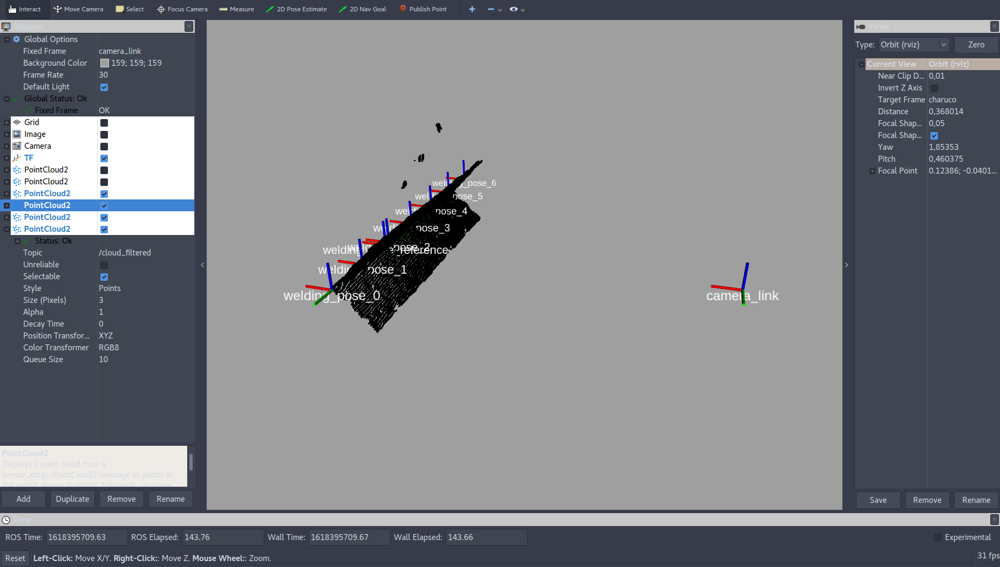

# Xweld - Local Perception Server


<a rel="license" href="http://creativecommons.org/licenses/by-nc-nd/4.0/">

* [Description](#Description)
* [Prerequisites](#Prerequisites)
* [Installation](#Installation)
* [Usage](#Usage)
* [Goal Parameters](#goal)
* [Configuration](#config)
* [Error List](#Error)
* [Convention](#Convention)

### <a name="Description"></a>1. Description

This package implements a local perception pipeline to estimate joint welding points using point clouds. For further detailed methodology description, check this [paper]().


<p align="center">
Joint welding estimation workflow.
</p>

### <a name="Prerequisites"></a>2. Prerequisites

The system was already tested on Ubuntu 16.04 and 20.04 with gcc-5 and gcc-9, respectively. The ROS version used was Kinect and Noetic (each one defined by a git branch version). The list of dependencies are placed below:

1. [ROS](http://wiki.ros.org/ROS/Installation)
2. [Catkin Tools](https://catkin-tools.readthedocs.io/en/latest/installing.html)
3. [PCL](https://pointclouds.org/downloads/) (PCL > 1.8.1 | Current Tests = PCL 1.11.0)
4. [Eigen 3](https://gitlab.com/libeigen/eigen/-/releases/3.3.9)
5. [Point Cloud IO](https://github.com/carlosmccosta/point_cloud_io)

### <a name="Installation"></a>3. Installation

1. Setup all prerequisites.
2. Download the [local_perception_welding_xweld](https://github.com/ItzMeJP/local_perception_welding_xweld) repository to the src folder of your catkin workspace.
3. Build the messages and then the server packages. Assuming your catkin workspace is located in ~/catkin_ws:

    ```
    cd ~/catkin_ws
    catkin build grasp_estimation_skill_msgs
    catkin build grasp_estimation_skill_server
    ```
4. To fast debug (without a camera setup), download the [Point Cloud IO](https://github.com/carlosmccosta/point_cloud_io) repository to the src folder and compile it:
    ```
    cd ~/catkin_ws
    catkin build point_cloud_io
    ```
### <a name="Usage"></a>4. Usage

#### <a name="example_case"></a>Example case

Run the following launch:
 ```
    roslaunch local_perception_server test.launch
 ```
Request action skill by sending the following goal. Check [this](#goal) section to further goal detail.
 ```
    rostopic pub /LocalPerceptionActionServer/goal local_perception_msgs/LocalPerceptionActionGoal "header:
     seq: 0
     stamp:
       secs: 0
       nsecs: 0
     frame_id: ''
    goal_id:
     stamp:
       secs: 0
       nsecs: 0
     id: ''
    goal:
     acquisition_distance: 0.2
     offset_compensation: [0, 0, 0]
     edge_tolerance: 0.0"
 ```


<p align="center">
Rviz output
</p>

  The result will be published at _/LocalPerceptionActionServer/result_ topic and can be verified by the following command:
 ```
rostopic echo /LocalPerceptionActionServer/result  
```

#### <a name="standalone_usage"></a>Standalone usage

For standalone usage, the user needs to configure the _config.yaml_ properly. Check [this](#config) section for further information. Then,  run the following launch:
 ```
    roslaunch local_perception_server run.launch
 ```

The goal request and result verification are the same as [example case](#example_case)
#### <a name="win_bridge"></a>Windows bridge usage

Install the rosbridge package:
 ```
sudo apt install ros-$ROS_DISTRO$-rosbridge-server
 ```

Run the main launch:
 ```
    roslaunch local_perception_server run.launch
 ```

 Run the bridge launch:
 ```
    roslaunch local_perception_server ros_bridge_websocket.launch address:=$SERVER_IP_ADDRESS$
 ```

For C# client development in Windows, check [Local Perception Client](https://github.com/ItzMeJP/local_perception_client) API.


### <a name="goal"></a>  4. Goal Parameters
The run-time parameters are defined in the goal. They are described below:

 1. **acquisition_distance**: The approximated acquisition euclidean distance (in meters) from camera to the welding region. This parameter will define the point cloud cropbox together with  _cropbox_ parameters in [config.yaml](#config).
 2. **offset_compensation**: An offset value array to adjust systematic errors. It sums the values in the welding pose results using the camera reference frame.
 3. **edge_tolerance**: deprecated.  

### <a name="config"></a> 5. Configuration

The configuration file (_config.xml_) is placed in _/config_ directory. The list of parameters are described below:

1. **ros_verbosity_level**: ROS verbosity level [DEBUG | INFO | WARN | ERROR | FATAL].
2. **pcl_verbosity_level**: PCL verbosity level [DEBUG | INFO | WARN | ERROR | FATAL].
3. **input_cloud_topic**: Point cloud input publish topic.
4.  **input_cloud_timeout_threshold**: Timeout to waiting for an valid input cloud
5.  **voxel_grid_filter**: Voxel point cloud downsampling filter. The leaf sizes need to be defined as a 3D-array. To deactivate the filter, set the array components to zero.
	```
	voxel_grid_filter:
	  leaf_sizes: [0.0005, 0.0005, 0.0005]
	```
6.  **cropbox**: Cropbox parameters to define the point region of interest. The cropbox is define by the [goal](#goal)   parameter _acquistion_distance_ in run-time. However, some parameters are necessary to be configured in load time. Check [this](#Convention) to  rame ID norm information.
	```
	cropbox:
	  enable: TRUE # active the cropbox
	  frame_id_norm: 1 # Cropbox reference frame | 0 - Optical Convention  1 - ROS convention
	  horizontal_fov: 86.0 # camera horizontal field of view [in degree]
	  vertical_fov: 56.0 # camera vertical field of view [in degree]
	  distance_range: 0.025 #tolerance range around the distance defined by the goal.
	```
7.  **sac_method**:  SAC configuration to plane estimation:
	```
	sac_method: # Generate an array of segmented planes. The size is defined by sac_method/max_number_of_planes and/or sac_method/left_rate_to_all_candidates. This array is ordered by biggest to lowest sized plane  
	  method_type: 0 # SAC_RANSAC  = 0; SAC_LMEDS   = 1; SAC_MSAC    = 2; SAC_RRANSAC = 3; SAC_RMSAC   = 4; SAC_MLESAC  = 5; SAC_PROSAC  = 6;  
	  model_type: 11 # Model Type (11 = PLANE)  
	  axis: "x"  
	  normal_k_search : 7  #This parameter allow to be independent radius search, therefore usefull for different resolution cameras  
	  normal_radius_search: 0 # 0.0005  
	  normal_distance_weight: 0.0005  
	  segmentation_threshold: 0.001  
	  inliers_threshold_weight: 0.01  
	  max_iterations : 100000  
	  eps_angle: 5  
	  left_rate_to_all_candidates: 0.50 #Find planes until this rate left in overall cloud  
	  max_number_of_planes: 2 #max number of found planes
	```
8. **plane_intersection**: Define parameters to estimate the intersection between two planes:
```
	plane_intersection: #define the intersection between plane A and B. It is a ideal line.  
	 index_cloud_plane_a: 0 # Define plane A since the ransac estimator generate an array of planes
	 index_cloud_plane_b: 1 # Define plane B since the ransac estimator generate an array of planes  
	 distance_to_line_threshold: 0.005 # Threshold that defines and select real points that are included into the ideal line region.
```

9.  **pose_filter/welding_interval**:  Define how many welding poses will be created.

### <a name="Error"></a>6. Error List

Below is listed the possible errors codes:
- **101**: The server acquisition point cloud (from sensor) timeout is exceeded;
- **102**: Server plane segmentation error. The input cloud is small to plane segmentation;
- **103**: Server plane segmentation error. Unable to fit a plane into segmented point cloud;
- **104**: Server input cropbox parameters error;
- **105**: Server down-sampling parameters error;
- **106**: Server welding joint estimation error. There are not enough planes in the input cloud;
- **107**: Server welding joint estimation error. The estimated planes are not parallel.

### <a name="Convention"></a>7. Convention
   The camera frame can be defined by the Optical or ROS convention according to the package/manufacturer design. See below:


<p align="center">
Types of frame convention
</p>
-----------------------------------------------------------------------------------------------------------------
<br />This work is licensed under a <a rel="license" href="http://creativecommons.org/licenses/by-nc-nd/4.0/">Creative Commons Attribution-NonCommercial-NoDerivatives 4.0 International License</a>.
